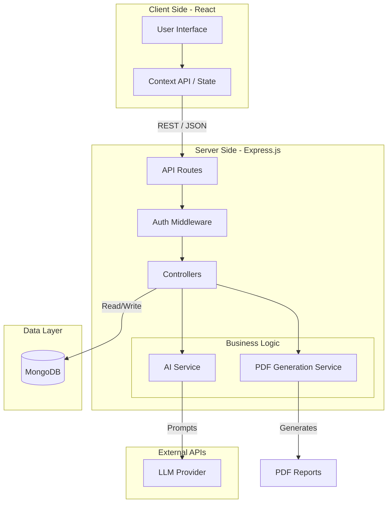

# 🚀 Skill Bridge AI

<p align="center">
  
  
  
  
  
  
</p>

## 🌟 Overview

**Skill Bridge AI** is a comprehensive, full-stack application designed to revolutionize interview preparation. By leveraging advanced Artificial Intelligence, the platform conducts realistic mock interviews, analyzes user responses, and generates detailed, actionable performance reports (including downloadable PDFs). 

Built with a strong emphasis on clean architecture, separation of concerns, and modern user experience, this project demonstrates proficiency in full-stack JavaScript development, API integration, and database management.

---

## 🏗️ System Architecture

Skill Bridge AI follows a robust **Client-Server architecture** with a well-defined **Service Layer** on the backend to handle complex business logic (AI integration and PDF generation) independently from the routing and controller layers.


---

## ✨ Key Features

- **🤖 AI-Powered Mock Interviews:** Context-aware questioning mechanism that adapts to user input using integrated AI services.
- **📊 Comprehensive Feedback & Analytics:** Generates detailed performance metrics and stores interview reports.
- **📄 Dynamic PDF Generation:** Users can export their personalized feedback reports as professionally formatted PDFs.
- **🔐 Secure Authentication:** JWT-based user authentication, password hashing, and token blacklisting mechanisms.
- **🎨 Modern Frontend Design:** Responsive, component-driven UI built with React, Vite, and SCSS modules.

---

## 📂 Project Structure

The repository is structured as a **Monorepo**, cleanly separating the frontend client and the backend API.
```text
Skill-Bridge-AI/
├── Backend/                 # Node.js / Express Server
│   ├── src/
│   │   ├── config/          # Database & Environment configuration
│   │   ├── controllers/     # Request handlers (auth, interviews)
│   │   ├── middlewares/     # Auth & File parsing middlewares
│   │   ├── models/          # Mongoose Schemas (User, Report, Blacklist)
│   │   ├── routes/          # API route definitions
│   │   └── services/        # Core business logic (ai.service.js, pdf.service.js)
│   └── server.js            # Application entry point
│
└── Frontend/                # React / Vite Client
    ├── src/
    │   ├── components/      # Reusable UI components (Loader, etc.)
    │   ├── features/        # Feature-sliced architecture (auth, interview)
    │   │   ├── auth/        # Context, Pages (Login/Register), API services
    │   │   └── interview/   # Interview UI, hooks, Context, API services
    │   ├── style/           # Global SCSS stylesheets
    │   ├── App.jsx          # Root component
    │   └── main.jsx         # React DOM renderer
```

---

## 💡 Technical Highlights (For Interviewers)

1. **Feature-Sliced Design (Frontend):** The React application organizes code by feature (`auth`, `interview`) rather than purely by file type. This improves maintainability, scalability, and code discovery.

2. **Service-Oriented Backend:** Business logic like communicating with the AI model (`ai.service.js`) and generating PDFs (`pdf.service.js`) are decoupled from controllers. This adheres to the **Single Responsibility Principle (SRP)** and makes the code highly testable.

3. **Security Best Practices:** Implementation of a token blacklist (`blacklist.models.js`) prevents compromised or logged-out JWTs from being reused.

4. **Custom Styling Architecture:** Utilizing SCSS with scoped styles ensures a conflict-free, highly customizable design system without over-relying on heavy UI frameworks.

---

## 🚀 Getting Started

### Prerequisites
- Node.js (v18+)
- MongoDB instance (Local or Atlas)

### Installation

1. **Clone the repository**
   ```bash
   git clone [https://github.com/yourusername/Skill-Bridge-AI.git](https://github.com/yourusername/Skill-Bridge-AI.git)
   cd Skill-Bridge-AI
   ```

2. **Setup Backend**
   
```bash
   cd Backend
   npm install
   # Create a .env file with PORT, MONGODB_URI, JWT_SECRET, and AI_API_KEY
   npm start
   ```

3. **Setup Frontend**
   ```bash
   cd ../Frontend
   npm install
   # Create a .env file for VITE_API_BASE_URL
   npm run dev
   ```

---

## 📄 License
This project is open-source and available under the standard MIT License.
